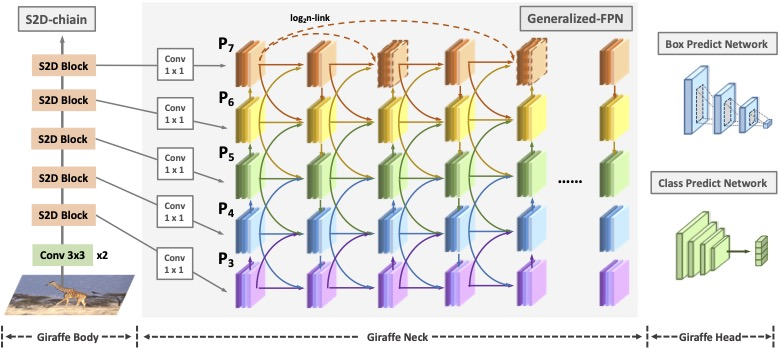

# GiraffeDet: A Heavy-Neck Paradigm for Object Detection

## Introduction
The GiraffeDet uses an extremely lightweight backbone and a very deep and large neck module which encourages dense information exchange among different spatial
scales as well as different levels of latent semantics simultaneously. This design paradigm allows detectors to process the high-level semantic information and low level spatial information at the same priority even in the early stage of the network,
making it more effective in detection tasks. Numerical evaluations on multiple popular object detection benchmarks show that GiraffeDet consistently outperforms previous SOTA models across a wide spectrum of resource constraints.

Analysis of GiraffeDet in ZhiHu: [GiraffeDet解读](https://zhuanlan.zhihu.com/p/466568282).


## Updates
1. We've removed the redundant 1x1 convolutions in GFPN Queen-Fusion module.
2. Now we support different channel number on different scale layer setting.

## Get Started

Please see [GETTING_STARTED.md](docs/get_started.md) for the basic usage of MMDetection.

## Train

```python
# assume that you are under the root directory of this project,
# and you have activated your virtual environment if needed.
# and with COCO dataset in 'data/coco/'

./tools/dist_train.sh configs/giraffeDet/giraffeDet_d7_scratch_6x.py 8 --validate
```

## Inference

```python
./tools/dist_test.sh configs/giraffeDet/giraffeDet_d7_scratch_6x.py work_dirs/giraffeDet_d7_scratch_6x/latest.pth 8 --eval bbox
```

## Models

For your convenience, we provide the following trained models (GiraffeDet).

Model | Multi-scale training | AP (minival) | AP (small) | AP(medium) | AP(large) | FLOPs(1280x768) | Link
--- |:---:|:---:|:---:|:---:|:---:|:---:|:---:
[GiraffeDet_d7](configs/giraffe_d7_scratch_6x.py) | Yes | 45.0 | 28.4 | 48.6 | 56.7 | 190.77 | [Link](https://idstcv.oss-cn-zhangjiakou.aliyuncs.com/GiraffeDet/giraffe_d7.pth)
[GiraffeDet_d11](configs/giraffe_d11_scratch_6x.py) | Yes | 46.6 | 29.4 | 50.6 | 58.5 | 272.07 | [Link](http://idstcv.oss-cn-zhangjiakou.aliyuncs.com/GiraffeDet/giraffe_d11.pth)


[0] *The reported numbers here are from new experimental trials (in the cleaned repo), which is slightly different from the original paper.* \
[1] *All results are obtained with a single model and without any test time data augmentation such as multi-scale, flipping and etc.* \
[3] *Refer to more details in config files in `config/giraffeDet/`.* \


## Acknowledgement

Thanks MMDetection team for the wonderful open source project!


## Citation

If you find GiraffeDet useful in your research, please consider citing:

```
@inproceedings{
jiang2022giraffedet,
title={GiraffeDet: A Heavy-Neck Paradigm for Object Detection},
author={yiqi jiang and Zhiyu Tan and Junyan Wang and Xiuyu Sun and Ming Lin and Hao Li},
booktitle={International Conference on Learning Representations},
year={2022},
url={https://openreview.net/forum?id=cBu4ElJfneV}
}
```


